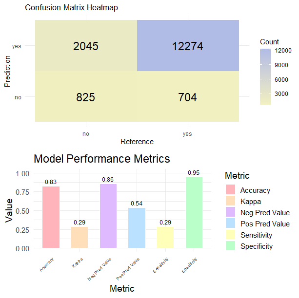
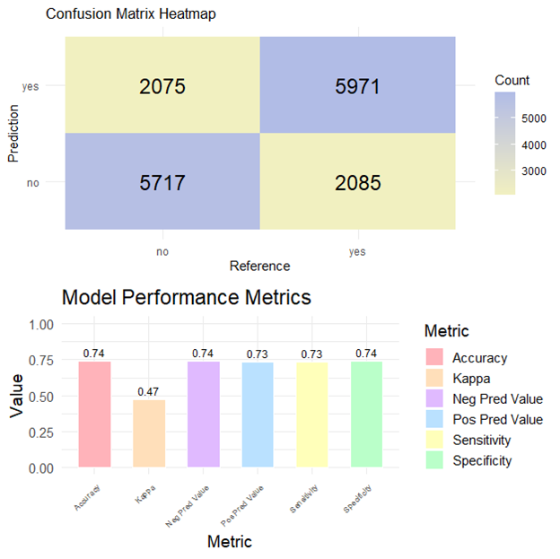

# Women_E-Commerce_Clothing_Review
## 1.0 Introduction
The dataset of Women's E-Commerce Clothing Review revolves around the reviews written by customers. 
The dataset is contributed by Nick Brooks who is currently a Machine Learning Engineer in London. 
The purpose of this dataset is to understand the correlation of different variables in customer reviews on a women's clothing e-commerce, and to classify each review whether it recommends the reviewed product or not and whether it consists of positive, negative, or neutral sentiment.

Data Source: https://www.kaggle.com/datasets/nicapotato/womens-ecommerce-clothing-reviews

In this project, the target variable are Rating and Recommended indicator.
Besides, both unsupervised and supervised learning techniques are used:
1. Unsupervised Learning:
   - Exploratory Data Analysis (EDA)
   - Principal Component Analysis (PCA)
2. Supervised learning:
   - Naive Bayes
   - Logistic Regression
   - Classification Tree
   - Support Vector Machine (SVM)
   - Random Forest

 

## 2.0 Data Dictionary
| No | Feature | Description | Values | Unique Count |
| ---| --- | --- | --- | --- | 
| 1. | Clothing ID | Integer categorical variable that refers to the specific piece being reviewed. | 0-1,205 | 1,172 |
| 2. | Age | Positive integer variable of the reviewer’s age. | 18-99 | 77 |
| 3. | Tittle | String variable for the title of the review | (String Text) | 13,984 |
| 4. | Review Text | String variable for the review body | (String Text) | 22,621 |
| 5. | Rating | Positive ordinal integer variable for the product score granted by the customer from 1 (worst) to 5 (best) |1-5 | 5 |
| 6. | Recommended IND | Binary variable stating where the customer recommends the product where 1 is recommended, 0 is not recommended. | 0,1 | 2 |
| 7. | Positive Feedback Count | Positive integer documenting the number of other customers who found this review positive. | 0-122 | 82 |
| 8. | Division Name | Categorical name of the product high level division. | Intimates, General, General Petite | 3 |
| 9. | Department Name | Categorical name of the product department name. | Intimate, Dresses, Bottoms, Tops, Jackets, Trend | 6 |
| 10. | Class Name | Categorical name of the product class name. | Intimates, Dresses, Pants, Blouses, Knits, Outerwear, Lounge, Sweaters, Skirts, Fine gauge, Jackets, Swim, Sleep, Trend, Jeans, Legwear, Layering, Shorts | 20 |

 

## 3.0 Pre-Processing
### 3.1 Data Cleaning
1. Features “Recommended.IND” and “Review.Text” are renamed with
“Recommended” and “Review” respectively.
   > colnames(df)[colnames(df) == "Recommended.IND"] = "Recommended"

   > colnames(df)[colnames(df) == "Review.Text"] = "Review"

2. Value in feature “Recommended” is changed from 0 and 1 to “no” and “yes”
respectively.
   > df$Recommended = ifelse(df$Recommended == 0,"no","yes")

3. Data type of feature “Rating”, “Recommended”, “Division.Name”, “Department.Name”, “Class.Name” are changed from integer to categorical type.
   > col_fac = c("Rating", "Recommended", "Division.Name", "Department.Name", "Class.Name")

   > df[col_fac] = lapply(df[col_fac], factor)

4. Remove unnecessary columns 
   > df$Title = NULL

   > df$Clothing.ID = NULL

   > df$X = NULL
   
5. Rows with missing values and empty string (“”) are removed.
   > df[apply(is.na(df),1,sum)>0,]

   > df = df[!df$Review == "",]

 

### 3.2 Determine Target Variable based on Feature Importance
Based on the result from Logistic Regression and ElasticNet graph, it can be obviously observed that the Rating variable is highly correlated to Recommended, which we initially pick as the target variable in this project. 

In the perspective of business, we could analyze the review in different views:
- Recommended (Yes/No): To evaluate whether the customers are recommending the clothes
- Rating (1-5): To evaluate the range of satisfaction towards the clothes

**Hence, we choose both Recommeded and Rating as the target variables in this project.**

 

### 3.3 Text Processing
Libraries “tm” and “SnowballC” are used.
Summary of actions took in the stage of processing review text:
1. Text documentation collection is done by using VCorpus(VectorSource()).
2. Short words with length smaller than or equals to 2 in the review text are removed.
   > remove_short_words = function(x) {
   > words = unlist(strsplit(x, "\\s+"))
   > words = words[nchar(words) > 2]
   > paste(words, collapse = " ")}

   > corpus = tm_map(corpus, content_transformer(remove_short_words))
3. Extra whitespaces are removed in the review text.
   > corpus = tm_map(corpus, stripWhitespace) 
4. All the words in the review text are converted to lowercase.
   > corpus = tm_map(corpus, content_transformer(tolower))
5. Numeric characters in the review text are removed.
   > corpus = tm_map(corpus, removeNumbers)
6. Punctuations in the review text are removed.
   > corpus = tm_map(corpus, removePunctuation)
7. English stopwords (eg. articles:a, an, the; conjunctions:and,but,or) in the review text are removed.
    > corpus = tm_map(corpus, removeWords, stopwords("en"))
8. A clean text function which removes mentions, urls, emojis, numbers, punctuation etc. is applied towards the review text.
    > clean_text = function(text) {
    > text = gsub("@\\w+", "", text)
    > text = gsub("https?://.+", "", text)
    > text = gsub("\\d+\\w*\\d*", "", text)
    > text = gsub("#\\w+", "", text)
    > text = gsub("[^\x01-\x7F]", "", text)
    > text = gsub("[[:punct:]]", " ", text)
    > return(text)}

    > corpus = tm_map(corpus, content_transformer(clean_text))
9. Stemming is applied towards review text to reduce words to their root form.
    > corpus = tm_map(corpus, stemDocument, language="english")
10. All the review text is then converted to Document Term Matrix and weighted with TF-IDF.
    > dtm = DocumentTermMatrix(corpus, control = list(weighting = weightTfIdf))
11. Sparse words, which are the lower occurrence words in the Document Term Matrix are removed to reduce the dimensionality of the matrix.
    > dtm = removeSparseTerms(dtm, .995)
12. The Document Term Matrix eventually is saved as a data frame.
    > tfidf_df = as.data.frame(as.matrix(dtm))

 

## 4.0 Data Understanding
### 4.1 Term Frequency analysis

 
Bar Chart of the Top 20 Most Frequent Words

We could interpret the following from this bar chart:
- The most frequently occurring word is “dress”. This indicates customers give a lot offeedback on the dress of the online clothing store.
- “love”, “fit” and “size” are the next three most frequently occurring words, which indicate that most people possibly love and feel good about the fit and size of the clothes.
- We could see that positive words like “love”, “like”, “great”, “perfect”, “nice” appearreally frequently, indicating most reviews could be positive ones.

Next, a word cloud is plotted to show a better visualisation on frequent words in the dataset.

#### **Word Association**
Correlation able to show whether and how strongly pairs of variables are related. This method can be used effectively to determine which words are most frequently used in association with the most common terms in the survey responses, which aids in understanding the context around these words. (Mhatre, 2020).

For example, we do a word association analysis for the top 3 most frequent terms
> findAssocs(tdm, terms = c("dress","fit","love"), corlimit = 0.10)

- The output indicates that “slip”, “wed”, “knee”, “can” occur within the range of 11% to 16% of the time with the word “dress”. We could interpret it to mean that probably a lot of people comment on the slip dress. 
- Similarly, the root of the words “perfect”, “size”, “loos”(root for word “loose”), “well” are highly correlated with the word “fit”. This indicates that most responses are saying that the size of the clothes is perfect, well and true and maybe some find it to be loose.

Hence, let us plot the word assoctiation network for the Top 20 Frequent Words.

 
Word Association Network of the Top 20 Most Frequent Words

- The thicker the edges, the stronger the correlation between the words.
- We could found that:
   - The mojor discussion of the customer is about size, as words such as fit, true, usual, normal, order, small, medium, chest, waist, lbs are tightly clustered.
   - Majority of the customer review the clothing (probably is the glove) is really look like the model (probable same as the picture). However, the thin edge with the word "dont" suggest there are fewer negative comments.
   - Customers frequently discuss colors, often with positive connotations (vibrant, rich, bright).

 

### 4.2 Sentiment Analysis
Sentiments can be classified as positive, neutral or negative. In order to more accurately convey the strength of the sentiment included in a body of text, they can also be expressed on a numerical scale.

**Syuzhet Vector**

Syuzhet package can be used to measures emotional valence
> syuzhet_vector = get_sentiment(df$clean_text, method="syuzhet")

> head(syuzhet_vector)

The meaning of sentiment scores:
- Positive - Positive sentiment
- Negative - Negative sentiment

> summary(syuzhet_vector)

To have a better visualisation, we plot a histogram with dentsity:

**From the summary and histogram, we could summarize that:**
- **Most reviews are positive** -> The median (1.85) and mean (1.95) are clearly above 0 and most of the scores are between 1 and 3.
- **Strong positivity exists** -> The max score is 7.65, showing some very enthusiastic reviews.
- **There are some negativity exists** -> The min score (-3.35) shows a few very negative reviews and there’s a small tail below 0.
- **Distribution skewed positive** -> Since 75% of reviews are above 1.0, customers are generally satisfied. The shape of the distribution is shifted to the right showing a strong bias towards positivity.

**Bing Vector**

Bing vectors classifies each word as positive (+1), neutral (0) or negative (-1).

> head(bing_vector)

- The first review has 2 more positive words than negative words (We can propose the first review is positive).

> summary(bing_vector)

Let us have a better visualisation from the distribution and the bar chart.

**From the summary and visualisation, we could summarize that:**
- In terms of satisfication, most customers are **happy and satisfied** with the clothing.

**Affin Vector**

Affin packages able to detect the strength of emotions, which scale range in between -5 (very negative) to +5 (very positive).

> head(afinn_vector)

> summary(afinn_vector)

So we have,

**From the summary and visualisation, we could summarize that:**
- The customers generally provide a very positive review.

  

**Pairwise Agreement**

Based on the pairwise agreement between three methods, all these vectors have shows a high level consistency(>85%) in detecting sentiment polarity across the data set. Hence, we can conclude that the sentiment analysis results are reliable and not strongly dependent on a single lexicon.

 

### 4.3 Emotional Analysis
We also able to classify the emotions based on the words.
> head (emotion,10)

For example, the first line of text has:
- Zero occurrences of words associated with emotions of anger, disgust, fear, sadness
and surprise
- One occurrence each of words associated with emotions of anticipation, joy and trust
- Total of zero occurrence of words associated with negative emotions
- Total of one occurrences of words associated with positive emotions

 

**Bar Chart showing the count of words in the text, associated with each emotion**

Based on the bar chart:
- Customers show trust in the clothing product as the emotion "trust" occured close to 500 times in the reviews.
- There are a small portion shows anger and disgust on the product.

 

**Bar Plot showing the count of words associated with each sentiment expressed as a percentage**

Based on the bar chart:
- The emotion "trust" has the longest bar, which demonstrates that words that express this positive feeling account for over 25% of all the meaningful words in this text.
- "disgust" has the shortest bar, indicating that less than 5% of the text's relevant words are related with this unpleasant emotion.
- Hence, around 70% of the meaningful terms of the text are words related to the nice feelings of "trust", "anticipation" and "joy" which can be seen as a positive indicator for the online clothing store.

 

### 4.4 Class Distribution

Based on the chart above, we noticed that the class distribution for the Recommend Target Variable is inbalance and the inbalance will cause bias to positive comments. Hence, we applied oversample using ROSE technique towards the models that we built later to see whether it helps to improve the performance of the models.

**Oversampling (ROSE)**
- The core of the package is the function ROSE, which creates artificial balanced samples and enables you to enhance any binary classifier's subsequent estimation. 
- A bootstrap-based method called ROSE (RandomOver-SamplingExamples) facilitates binary classification in the presence of rare classes.
- Through the creation of synthetic examples from a conditional density estimate of the two classes, it can handle both continuous and categorical data.
- In addition, the function ovun.sample employs traditional solutions to the class imbalance, such as over-sampling the minority class, under-sampling the majority class, or combining bothover- and under-sampling. 

 

<!-- ### 4.5 Sxploratory Data Analysis -->

### 5.0 Supervised Learning
### 5.1 Recommended
### 5.1.3 Classification Tree
We have tried different packages: rpart() and tree().

<table>
   <thead>
      <tr>
         <th></th>
         <th colspan='2' align='center'>Without Oversampling</th>
         <th colspan='2' align='center'>Oversampling</th>
      <tr>
         <th> </th>
         <th>Using rpart()</th>
         <th>Using tree()</th>
         <th>Using rpart()</th>
         <th>Using tree()</th>
      </tr>
   </thead>
   <tbody>
      <tr>
         <td>Summary</td>
         <td>
             
            <ul><li>As the size of current tree is not very large and  the xerror is the lowest at the latest split. Hence, pruning is omitted.</li></ul>
         </td>
         <td>
             
         </td>
         <td>
             
            <ul><li>As the size of current tree is not very large and  the xerror is the lowest at the latest split. Hence, pruning is omitted.</li></ul>
         </td>
         <td>
             
         </td>
      </tr>
      <tr>
         <td>Plot</td>
         <td>
             
            Based on the model, it inidicates that:
            <ul>
               <li>Customers will return the product as the size of the product is smaller size (which is not fit). Hence, the customer will not recommend the product.</li>
               <li>Customer feels disappointed and not recommend when the products are not perfect.</li>
            </ul>
         </td>
         <td>
             
            Based on the model, it inidicates that:
            <ul>
               <li>The result most likely same as rpart() package</li>
            </ul>
         </td>
         <td></td>
         <td></td>
      </tr>
      <tr>
         <td>Train Performance</td>
         <td>
             
            <ul>Noticed that:
               <li>The Kappa and Sensivity values are relative low.</li>
               <li>The model very poor on detecting the "no" class as the target variable is imbalance.</li>
            </ul>
         </td>
         <td>
             
            <ul>
               <li>The result is similar with rpart().</li>
            </ul>
         </td>
         <td>
             
            <ul>Noticed that:
               <li>The Kappa is relative low but Sensitivity increases after oversampled.</li>
            </ul>
         </td>
         <td>
             
            <ul>
               <li>The result is similar with rpart().</li>
            </ul>
         </td>
      </tr>
      <tr>
         <td>Test Performance</td>
         <td></td>
         <td></td>
         <td></td>
         <td></td>
      </tr>
      <tr>
         <td>ROC Curve Plot</td>
         <td></td>
         <td></td>
         <td></td>
         <td></td>
      </tr>
      <tr>
         <td>AUC Value</td>
         <td>
            <ul>
               <li>Train data:  0.6114563 </li>
               <li>Test data:  0.625995</li>
            </ul>
         </td>
         <td>
            <ul>
               <li>Train data:  0.7311405</li>
               <li>Test data:  0.7291646</li>
            </ul>
         </td>
         <td>
            <ul>
               <li>Train data:  0.7810421 </li>
               <li>Test data:  0.7597905</li>
            </ul>
         </td>
         <td>
            <ul>
               <li>Train data:  0.7613131</li>
               <li>Test data:  0.7492651</li>
            </ul>
         </td>
      </tr>
   </tbody>
</table>
<b>Conclusion: tree() package is more suitable for this model.</b>

 

### 7.0 References
Mhatre. S. (2020). Text Mining and Sentiment Analysis: Analysis with R. Redgate. https://www.red-gate.com/simple-talk/databases/sql-server/bi-sql-server/text-mining-a nd-sentiment-analysis-with-r/

